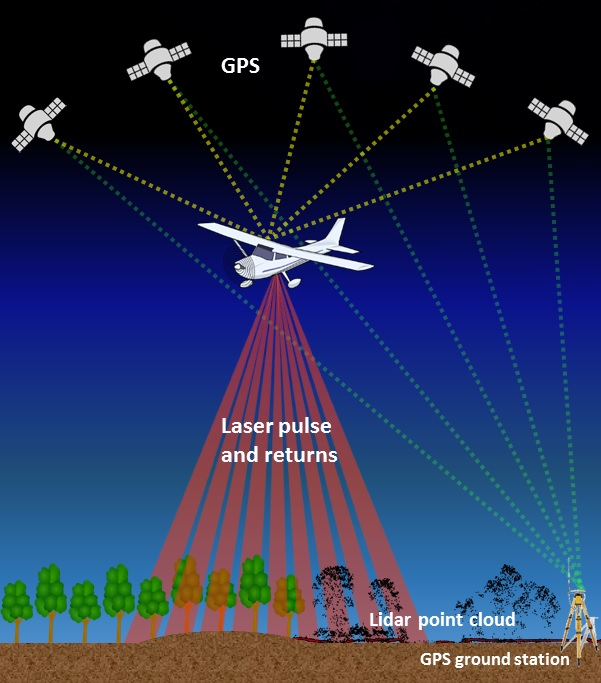
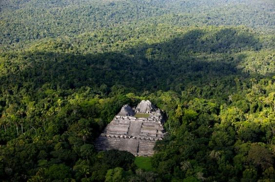
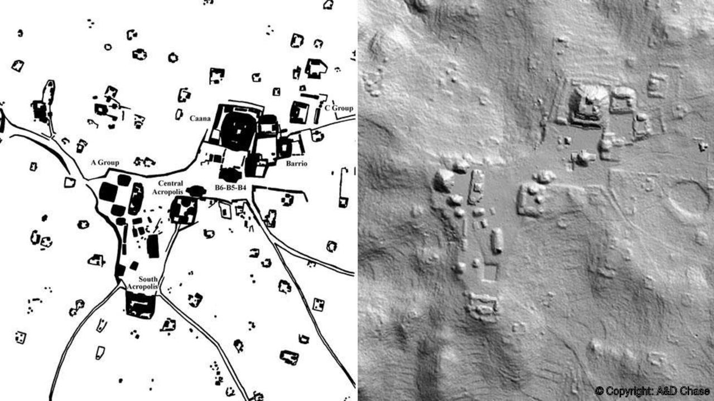

```{r setup, include=FALSE}
knitr::opts_chunk$set(echo = TRUE)
```

Install and load the following packages: {raster}, {rgdal}, {lidR}, {tmap}, {devtools}, {rayshader}

for rayshader: devtools::install_github("tylermorganwall/rayshader")


#LiDAR

**Li**ght **D**etection **A**nd **R**anging **(LiDAR)** is very useful survey method that uses pulses of laser light to measure reflected distance between a given sensor (typically on the bottom of an airplane) and a survey area. 



This becomes exceptionally useful when your research area is in the middle of a neo-tropical jungle. 3D images and maps can be created based on the differences in response time, where objects that are higher in elevation are returned more quickly than objects lower in elevation.  



You can see that the forest canopy is fairly dense around the site. LiDAR essentially allows us to complete an aerial survey and remove the canopy layer to see what is happening below the tree line.  



##Using LiDAR data to create Digital Elevation Models in R

The first thing we will need to do is set up a working directory for the files.

```{r}
# Load needed packages
library(raster)
library(rgdal)

# set working directory to data folder
setwd("C:/Users/ajlocker/Desktop/R Geospatial")
```

You'll need to go to my github and download the following files and save them inside your working directory. 

https://github.com/ajlocker/ADA-SpatialAnalysis/blob/master/ATXLiDAR/demTIN.tif

https://github.com/ajlocker/ADA-SpatialAnalysis/blob/master/ATXLiDAR/hsTIN.tif

Next, we are going to load in the data by assigning them to be rasters. The DEM file is a Digital Elevation Model, which tells R elevation values from the scanned LiDAR data. The hs file is a Hillslope image.  

```{r}
# assign raster to object
dem <- raster("C:/Users/ajlocker/Desktop/R Geospatial/ATX/demTIN")

# view info about the raster.
dem
```

Plot the Digital Elevation Model
```{r}
plot(dem, main="Digital Elevation Model \n Austin, Texas")
```


So here, we can see basic elevation differences from the surveyed area, but it doesn't show us much detail from the LiDAR imaging. We can examine this data much more effectively by plotting it on top of the Hillshade file, which will essentially add depth to the map. 

```{r}
hs <- raster("C:/Users/ajlocker/Desktop/R Geospatial/ATX/hsTIN.tif")

# view info about the raster.
hs
```

```{r}
# plot hillshade file
plot(hs,
        col=grey(1:100/100),  # creates a gray scale coloring for the hillshade data
        legend=FALSE,         # removes any legend
        main="LiDAR Survey UT Campus", #sets the title of the image
        axes=FALSE)           # removes any axes titles to keep the image looking clean

#then plot the CHM ontop of the hillshade
plot(dem, 
        axes=FALSE,
        alpha=0.5,   # transparency of the object (0=transparent, 1=not transparent)
        add=T)  # add=TRUE (or T); this will add the chm plot on top of the plot we coded immediately above
```

#Creating 3D Maps
There is a great package called Rayshader, where you can mainpulate raster images in some really cool ways. 

```{r}
# To install the latest version from Github:
library(devtools)
devtools::install_github("tylermorganwall/rayshader")
```

We're going to use the same raster file we used to create the last map. 

```{r}
library(rayshader)

#First, we need convert our raster to a matrix:
utmat = matrix(raster::extract(hs,raster::extent(hs),buffer=1000),
               nrow=ncol(hs),ncol=nrow(hs))

#Then we are going to add some texture using rayshader's built-in textures:
utmat %>%
  sphere_shade(texture="imhof2") %>%
    plot_map()
```

```{r}
#adds ambient shading to the map
ambmat = ambient_shade(utmat)

#This will generate a 3D interactive map
utmat %>%
  sphere_shade(texture = "unicorn") %>%
  add_water(detect_water(utmat), color="unicorn") %>%
  add_shadow(ray_shade(utmat,zscale=3,maxsearch = 300),0.5) %>%
  add_shadow(ambmat,0.5) %>%
  plot_3d(utmat,zscale=10,fov=0,theta=135,zoom=0.75,phi=45, windowsize = c(1000,800))
render_snapshot()
```


